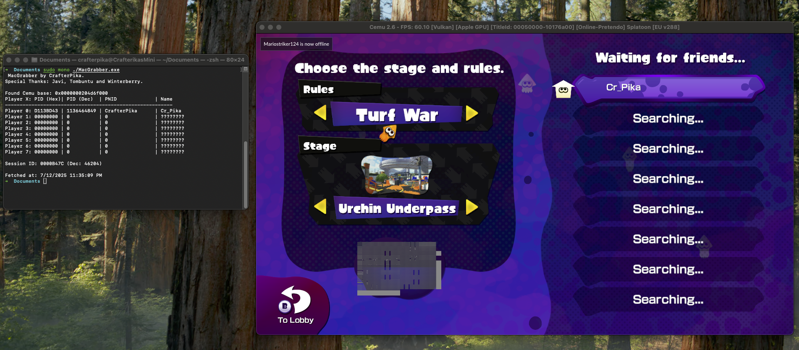

# MacGrabber

Splatoon v288 Cemu PID Grabber for MacOS.
Download latest release [here](https://github.com/CrafterPika/MacGrabber/releases/latest).



# Output

Tool will provide following output:
- Player Number
- Player Name
- PID (hex & dec format)
- PNID (Fetched from Pretendo's API)
- Session ID (hex & dec format)
- Fetch date (time when the script ran)

# Compile

You'll need [brew.sh](https://brew.sh) to compile this project

Install mono using homebrew:
```
brew install mono
```

To compile the code:
```bash
mcs -out:MacGrabber.exe MacGrabber.cs -r:System.Net.Http -r:System.Xml.Linq
```

Run it while Splatoon is open in Cemu:
```
sudo mono ./MacGrabber.exe
```

# Credits

Special Thanks goes to:
- [Javi](https://github.com/javiig8): PID Pointer chain in [Splatheap-PID-Grabber](https://github.com/javiig8/Splatheap-PID-Grabber/blob/33166b5d679043f82b451f778b5918be228c88eb/splatheap/Form1.cs#L89)
- [Tombuntu](https://github.com/ReXiSp): For the Session ID Pointer Chain
- [Winterberry](https://github.com/c8ff): For the original [LinuxGrabber](https://github.com/c8ff/LinuxGrabber) where this project is obviously based on.
